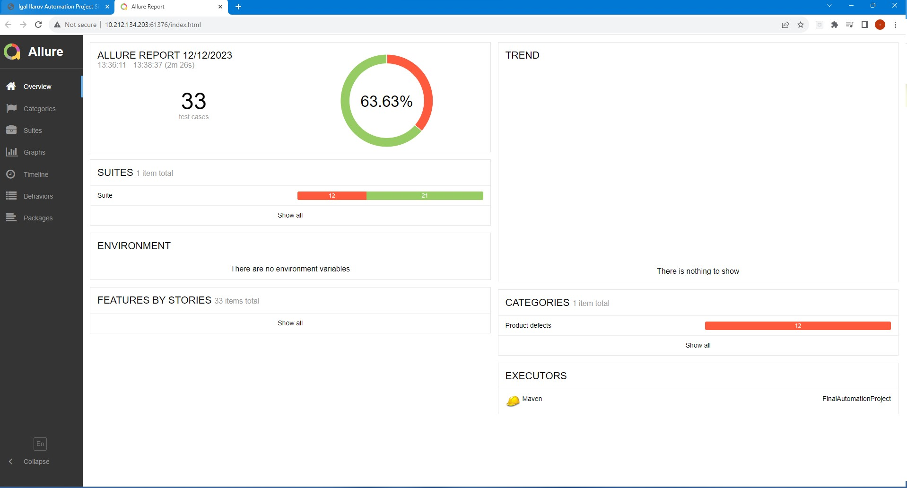
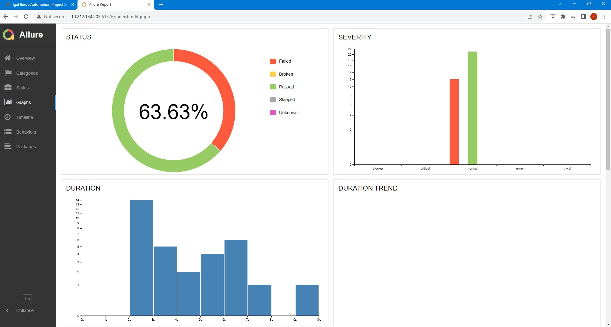

## My Final Automation Project
This is a testing automation project that tests a real site called: https://www.saucedemo.com

## Overview
This repository contains a comprehensive automated testing project built with Java, TestNG, and Allure Reports. 
The project follows the Page Object Model (POM) design pattern for a modular and maintainable test suite.

## Features

- **Java:** The project is developed using Java, providing a robust and widely used programming language for automation.
  
- **TestNG:** TestNG is used as the testing framework, offering powerful test configuration options, parallel execution, and detailed reporting.

- **Page Object Model (POM):** The project follows the POM design pattern, enhancing test maintainability and reusability by separating page elements and actions.

- **Allure Reports:** Test results are documented using Allure Reports, providing a clear and interactive visualization of test execution.

- **Logging:** The project includes logging capabilities to capture and document important events during test execution.

  ## Reports
<p>
  
  
</p>

## Getting Started

1. **Clone the Repository:**
   ```bash
   git clone https://github.com/IgalIlarov/MyAutomationProject
